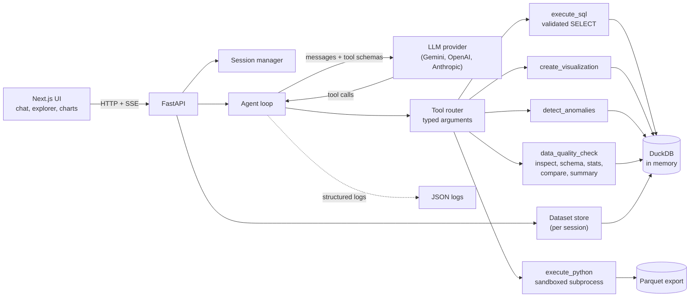

# DataPilot

An AI data analyst for CSV files. Upload one or more datasets, ask questions in plain English, and get answers, charts, SQL, anomaly explanations and data quality reports.

The LLM never does the maths. It plans, picks tools and writes queries. Deterministic tools (DuckDB, pandas, statistics code) execute everything against the real data, and every figure in an answer can be traced back to a tool result.


## Features

- **CSV upload**: drag and drop several files at once. Validation covers extension, size, binary content, empty files, encoding (UTF-8 and Latin-1) and delimiter detection. Malformed rows are skipped and reported instead of failing the file.
- **Dataset profiling**: columns, types, kinds (numeric, categorical, date, text, boolean), missing values, duplicates, cardinality, ranges, top values, preview and a schema viewer.
- **Data quality**: missing values, duplicate rows, numbers stored as text, unparseable dates, inconsistent categories (case and whitespace), constant columns, high-cardinality columns, negative or extreme values. A 0 to 100 score per dataset.
- **Dataset overview**: key metrics, clipped histograms, categorical breakdowns, missing data summary and suggested questions generated from the schema.
- **Natural language analysis**: rankings, trends, comparisons, averages, joins, correlations and SQL generation, all executed on the data.
- **Charts**: bar, line (with series), pie, scatter and histogram. Chart values come from a SQL query the tool executes, never from the model.
- **Anomaly detection**: IQR, z-score and a time aware rolling median method. Each result carries the affected rows, the bounds, a severity and a reason computed from the statistics.
- **Multi-file analysis**: join keys are inferred from names and value overlap (with cardinality), can be declared manually, and are given to the model with advice to avoid fan-out double counting.
- **Conversation memory**: previous questions, tool results and a "focus" (for example `region = North America`) are kept so follow-ups like "show me its monthly trend" resolve correctly.
- **Streaming**: server-sent events stream text, tool calls and tool results as they happen.
- **Grounding check**: after each answer, numbers that do not appear in any tool result are flagged to the user.
- **Observability**: structured JSON logs with request and session IDs, tool timings, query timings and LLM latency and token counts, plus a Prometheus `/api/metrics` endpoint.
- **Persistence**: sessions live in a per-session DuckDB file. Datasets, relationships, filters, conversation memory and the saved transcript survive a server restart, and DuckDB spills to disk so large files do not have to fit in memory. Uploads are streamed to disk, never held whole in memory.
- **Access control and cost protection**: optional access token login, per-IP rate limits, a question quota on the shared server key, and API keys encrypted in memory and never written to disk.
- **Sharing your work**: export any result table as CSV (spreadsheet formula injection neutralised), export the whole conversation as a Markdown report with answers, tables, SQL and anomaly explanations, and switch bar, line and pie charts in place.
- **Accessible and responsive UI**: works on phone widths with a slide-out dataset panel, keyboard focus on scrollable regions, labelled controls and live regions for streaming answers. Audited with axe-core (WCAG 2.1 A and AA) with no violations across the main views.

## Architecture



One turn of the agent loop:

```
user question
  -> system prompt (schema, relationships, conversation state, rules) + history
  -> LLM streams text and/or structured tool calls
  -> tool router validates arguments with Pydantic and runs the deterministic tool
  -> tool result goes back to the LLM (rows trimmed, never the full dataset)
  -> repeat up to MAX_AGENT_STEPS
  -> final answer, grounding check, history and analysis record saved
```

The model only ever sees the schema, statistics, a few sample values and the (trimmed) result of each tool call. Full datasets stay inside DuckDB.

### Repository layout

```
backend/app/
  main.py            FastAPI app, middleware, error handlers
  config.py          environment based settings
  models.py          typed models shared by tools and API
  session.py         sessions, expiry, persistence and restore
  limits.py          per-client sliding window rate limiter
  metrics.py         Prometheus style counters
  secrets_box.py     encryption for API keys held in memory
  api/               routes, request/response schemas, auth and rate limit dependencies
  agent/
    agent.py         the tool calling loop, streaming events, grounding check
    tools.py         tool definitions, argument models, router
    prompts.py       system prompt and conversation state
    llm.py           provider abstraction (Gemini, OpenAI, Anthropic)
  data/
    loader.py        upload validation and CSV loading
    datasets.py      per-session DuckDB store
    profiler.py      schema inference and column statistics
    quality.py       data quality checks
    anomalies.py     IQR, z-score, rolling median
    charts.py        chart data from query results
    relations.py     join key inference
    engine.py        SQL validation and execution
    sandbox.py       Python sandbox (parent side)
    sandbox_runner.py  Python sandbox (child process)
    overview.py      dashboard summary and suggested questions
frontend/src/        Next.js app, components, API client, SSE parser
data/                sample CSVs and the script that generated them
tests/               pytest suite (no LLM or network needed)
evaluation/          ground truth evaluation cases and runner
docs/                reviewer checklist, deployment guide and screenshots
.github/workflows/   CI: tests, evaluation, audits, Docker build
```

## Tech stack

| Layer | Choice |
| --- | --- |
| Frontend | Next.js 15, TypeScript, Tailwind CSS, Recharts |
| Backend | Python 3.11+, FastAPI, Pydantic |
| Data | DuckDB (SQL), pandas and numpy (statistics, sandbox), PyArrow (Parquet hand-off) |
| LLM | Gemini, OpenAI (one OpenAI-compatible provider) and Anthropic, all with tool calling, behind a small `LLMProvider` class |
| Tests | pytest, Vitest |
| Packaging | Docker and docker-compose |

## Setup

Requirements: Python 3.11+, Node 20+, and a Gemini, OpenAI or Anthropic API key for live questions.

```bash
cp .env.example .env
```

You can either set a server default key in `.env` (`LLM_PROVIDER` plus `GEMINI_API_KEY`, `OPENAI_API_KEY` or `ANTHROPIC_API_KEY`), or skip that and paste a Gemini or OpenAI key into **Settings** in the UI. A key entered in the UI is kept in server memory for that session only, is never returned by the API and is never logged. Everything except asking questions (upload, preview, quality, overview, tests) works without a key.

### Environment variables

| Variable | Default | Purpose |
| --- | --- | --- |
| `LLM_PROVIDER` | `anthropic` | Server default provider: `gemini`, `openai` or `anthropic` |
| `GEMINI_API_KEY`, `OPENAI_API_KEY`, `ANTHROPIC_API_KEY` | empty | Server default key for the chosen provider. Never sent to the browser. |
| `LLM_MODEL` | provider default | Server default model (`gemini-2.5-flash`, `gpt-4o-mini`, `claude-sonnet-5-5`) |
| `LLM_MAX_TOKENS` | `2048` | Max output tokens per LLM call |
| `ACCESS_TOKEN` | empty | When set, every API call except health and config needs `Authorization: Bearer <token>` and the UI shows a login screen |
| `SECRET_KEY` | random per start | Fernet key used to encrypt API keys held in memory |
| `SERVER_KEY_TURN_LIMIT` | `100` | Questions a session may ask on the shared server key (own key is exempt) |
| `CHAT_PER_MINUTE`, `UPLOAD_PER_MINUTE`, `SESSION_CREATE_PER_HOUR` | `12`, `20`, `30` | Per client IP rate limits |
| `TRUST_PROXY` | `false` | Read the client IP from `X-Forwarded-For` (only behind a trusted proxy) |
| `SANDBOX_MODE` | `subprocess` | `off` removes the `execute_python` tool entirely |
| `UPLOAD_ROOT` | `var/sessions` | Where session folders (DuckDB file, metadata, transcript) are stored |
| `DUCKDB_MEMORY_LIMIT` | `1GB` | Memory per session before DuckDB spills to disk |
| `MAX_UPLOAD_MB` | `50` | Per file upload limit |
| `MAX_FILES_PER_SESSION` | `10` | Datasets per session |
| `SESSION_TTL_MINUTES` | `120` | Idle session expiry |
| `MAX_RESULT_ROWS` | `200` | Rows returned per query |
| `SQL_TIMEOUT_SECONDS` | `15` | Query cancellation |
| `PYTHON_TIMEOUT_SECONDS` | `10` | Sandbox wall clock limit |
| `PYTHON_MEMORY_MB` | `2048` | Sandbox memory limit (Linux rlimit, Windows job object) |
| `MAX_AGENT_STEPS` | `8` | Tool loop bound per question |
| `CORS_ORIGINS` | `http://localhost:3000` | Allowed browser origins |
| `SAMPLE_DATA_DIR` | `./data` | Folder offered by "Load sample data" |
| `NEXT_PUBLIC_API_URL` | `http://localhost:8000` | Frontend to backend URL (frontend `.env`) |

## Running locally

Backend:

```bash
cd backend
pip install -r requirements.lock
uvicorn app.main:app --port 8000
```

Frontend:

```bash
cd frontend
npm install
npm run dev
```

Open http://localhost:3000, click **Load sample data** and start asking questions.

### Tests

```bash
pip install -r backend/requirements-dev.txt
pytest
cd frontend && npm test && npm run typecheck
```

## Running with Docker

```bash
cp .env.example .env
docker compose up --build
```

The UI is on http://localhost:3000 and the API on http://localhost:8000. The backend container runs as a non-root user with a read-only root filesystem, dropped capabilities, a process and memory limit, and a named volume for session data. The sample data is mounted read-only from `./data`. See [docs/DEPLOY.md](docs/DEPLOY.md) for production settings, HTTPS, monitoring and alert examples.

## Example questions

With the sample data (`orders.csv`, `customers.csv`, `products.csv`):

- Which region generated the highest revenue?
- Show monthly sales trends
- Which products are underperforming?
- What are the top five customers by revenue?
- What is the average order value?
- Compare revenue between regions
- Which month had the highest sales?
- Detect anomalies in revenue and explain them
- Were there unusual spikes in order volume over time?
- Compare revenue across customer segments (uses a join)
- How correlated are quantity and revenue? (uses Python)
- Generate SQL for revenue by region
- Which region has the highest revenue? followed by Show me its monthly trend

The sample data (`data/generate_sample_data.py`, seeded) contains seasonality, growth, one dominant region, deliberately weak products and planted problems: a handful of huge orders, a negative revenue row, an order spike on 2024-03-15, a sales dip in mid August 2023, missing values and duplicate rows.

## Agent and tool architecture

All tools take Pydantic argument models and return a typed `ToolResult` (data, error, SQL, code, table, chart, anomalies). Invalid arguments, unknown tools and tool failures come back to the model as readable errors so it can correct itself.

| Tool | What it does |
| --- | --- |
| `inspect_dataset` | Row count, columns, types, ranges, sample rows |
| `get_schema` | All datasets, columns and relationships |
| `get_column_statistics` | Exact statistics for one column |
| `execute_sql` | Validated read-only DuckDB SELECT |
| `execute_python` | Sandboxed pandas and numpy for what SQL cannot express |
| `create_visualization` | Runs the supplied SQL and builds a chart (bar, line, pie, scatter, histogram) |
| `detect_anomalies` | IQR, z-score or time series detection, one column or a scan |
| `data_quality_check` | The quality report for a dataset |
| `compare_datasets` | Shared columns, join candidates with overlap and cardinality, join SQL |
| `generate_summary` | Dashboard style overview with suggested questions |
| `set_context_filters` | Remembers entities in focus for follow-up questions |

The user facing explanation is analytical provenance, not hidden reasoning: the executed SQL or code, the tool timeline and the computed anomaly reason.

The LLM sits behind `LLMProvider.stream(system, messages, tools)` in `agent/llm.py`. Gemini and OpenAI share `OpenAICompatibleProvider` (Gemini through its OpenAI compatible endpoint); Anthropic has its own class. To add another provider, implement that one method and return it from `create_provider`.

## Security considerations

- **Uploads**: extension allow list, size limit enforced while streaming to disk, NUL byte (binary) check, empty file check, streaming re-encoding to UTF-8, random file names in a per-session folder removed when the session ends.
- **SQL**: every query is parsed by DuckDB. Exactly one statement, SELECT only, table function calls restricted (no `read_csv`, `glob` and similar), only the session's own tables allowed, execution timeout and row cap. Mutations, `ATTACH`, `COPY`, `PRAGMA` and multi statement input are rejected before execution.
- **Python**: the code is checked with an AST allow policy (no imports, no dunder access, no `open`, `eval`, `getattr`, file or network pandas and numpy functions) and then runs in a separate interpreter with an empty environment, an empty working directory, a restricted builtins table, a wall clock timeout and CPU, memory and file size limits (rlimits on Linux, a job object memory limit on Windows). Pandas, numpy, math and statistics are wrapped so user code can never be handed a module (this closed a real escape through `pd.compat.os`). `SANDBOX_MODE=off` removes the tool completely. The model can never run shell commands. See the limitations for what this does and does not guarantee.
- **Prompt injection**: dataset values are truncated in the prompt and the system prompt marks them as untrusted data.
- **Access control**: optional bearer token (constant time comparison) on every API route except health and config. Sessions are 128 bit random identifiers.
- **Abuse and cost control**: sliding window rate limits per client IP on chat, uploads and session creation, 429 responses with `Retry-After`, and a per session question quota when the shared server key is used.
- **API keys**: a key entered in the UI is encrypted with Fernet in memory, never returned by the API, never logged and never persisted. Session restore deliberately drops it.
- **Dependencies**: versions pinned in `backend/requirements.lock`, audited with `pip-audit` and `npm audit --omit=dev` in CI. The last audit found and fixed vulnerable `starlette`, `python-multipart`, `cryptography`, `anyio`, `idna`, `python-dotenv` and `next`/`postcss`.
- **API hygiene**: typed request validation, sanitised error messages (no stack traces, technical detail goes to the server log), request IDs, CORS allow list, no secrets in responses or logs.
- **Privacy**: logs contain timings, tool names, truncated SQL text and sizes, never result rows.

## Evaluation methodology

`evaluation/cases.py` defines representative questions. Ground truth is computed independently with pandas straight from the CSV files, so there are no hard-coded expected numbers.

```bash
python evaluation/run_eval.py --mode tools
python evaluation/run_eval.py --mode live
```

- **tools mode** (no LLM, runs in CI as `tests/test_evaluation.py`): executes a reference tool plan for each case on the real tools and checks numeric correctness against pandas, SQL validity, chart generation, anomaly detection, rejection of destructive SQL, missing column handling, empty results (no fabrication) and the grounding detector.
- **live mode** (needs a key for the configured provider, for example `LLM_PROVIDER=gemini GEMINI_API_KEY=...`; `--only id1,id2` picks cases and `--pause 12` paces calls under free tier rate limits): lets the model plan. It additionally checks tool selection, that the expected facts appear in the answer, that no ungrounded numbers were produced, and that ambiguous or unanswerable questions are handled with an assumption or an honest "no data" answer.

Categories: numeric, multi_file, python, chart, anomaly, sql, quality, hallucination, safety, ambiguity, context. Results are written to `evaluation/results/`; the committed `tools_mode.json` is the latest tools mode run (21 of 21 passing).

Live results so far (Gemini 2.5 Flash, see Known limitations for the quota caveat): 12 of 18 cases passed, including the two turn follow up where "its" is resolved from conversation context, anomaly detection, SQL generation, the hallucination cases and the destructive request refusal.

## Screenshots

| | |
| --- | --- |
|  |  |
| Answer with tool timeline and a chart | Anomaly card with a computed explanation and affected rows |
|  |  |
| Dataset overview with clipped distributions | Data quality report |

The screenshots were captured without an API key, using the scripted stand-in LLM from the test suite. The tool calls, SQL, chart data, anomaly statistics and quality results in them are real and computed on the sample data; only the model's wording was scripted.

## Demo video

No video is bundled. A good two minute walkthrough: load sample data, open Data explorer (overview and quality), ask "Which region generated the highest revenue?", then "Show me its monthly trend" (context), "Detect anomalies in revenue and explain them", "Generate SQL for revenue by region" (expand the SQL block), then upload an invalid file to show error handling.

## Design decisions

- **DuckDB as the single analytical engine.** CSVs become in-memory tables, so SQL, profiling, anomaly input and chart data all use one fast engine with no server.
- **Tools own the numbers.** Aggregations, statistics, anomaly bounds and chart points are computed in code. The model synthesises and explains. A grounding check catches numbers that slip through.
- **Pydantic at every boundary.** Tool arguments, tool results and API payloads are typed, and the JSON schemas sent to the model are generated from the same classes.
- **Parser based SQL guard.** Validation walks DuckDB's own parse tree rather than matching strings, so comments, casing and nesting cannot hide a forbidden call.
- **Subprocess sandbox for pandas.** Simple, portable and enough for an assignment, with clear honesty about its limits.
- **One DuckDB file per session.** No database server to run. The file gives persistence across restarts and disk spilling for large data, while sessions still expire and delete their folder.
- **Plain SSE over fetch.** One POST that streams typed events. No WebSocket or extra client library.
- **Small module count.** Modules follow responsibilities (loader, profiler, quality, anomalies, charts) rather than one file per function.

## Known limitations

- **Sandbox strength.** The Python sandbox is defence in depth (AST policy, module-refusing wrappers, separate process, empty environment, CPU, memory and file limits), not a hardened jail. Network blocking relies on the AST policy and the absence of imports, not on a network namespace. For stronger isolation run the backend in a container with no extra privileges (the compose file does), or set `SANDBOX_MODE=off` to remove Python execution entirely. The limits were exercised on Windows (job object) and on Ubuntu 22.04 under WSL (rlimits); the full test suite passes on both.
- **Docker images were not built here.** The Dockerfiles, compose file and CI workflow are written and the compose file validates, but Docker Desktop would not start in the build environment, so `docker compose up` has not been run. The CI workflow builds both images and checks the health endpoint.
- **Live LLM coverage is partial.** Only Gemini was run live. Of 18 live evaluation cases, 12 passed, 4 could not complete because the Gemini free tier allows only 20 requests per day for `gemini-2.5-flash` and the quota ran out, and 2 failed: `region_comparison_chart` (the model answered with a table and no chart; the system prompt now asks for a chart on comparisons, not yet re-verified live) and `top_five_customers` (an expected figure was missing from the answer; the cause was not determined before the quota ended, a different but reasonable interpretation such as excluding returned orders is possible). OpenAI and Anthropic are covered with faked clients only.
- **Single worker.** DuckDB files are single writer and the rate limiter and session map live in process memory. Scale vertically or run independent deployments.
- **Authentication is a shared token.** `ACCESS_TOKEN` gates the whole deployment. There are no per-user accounts, teams, roles or share links. Sessions are 128 bit random identifiers, so treat a session ID like a password.
- **Not built, on purpose.** Scheduled analyses, connectors to databases or Google Sheets, and shareable live dashboards are separate products. The Markdown report export is the sharing path. A job queue was not added because uploads are processed synchronously (a 400,000 row file profiles in about a second).
- **Chart editing is limited** to switching between bar, line and pie and inspecting the data.
- **Large files** are spilled to disk by DuckDB but profiling and overview still read whole columns, so multi gigabyte files should be sampled or pre-aggregated.
- **Anomaly defaults.** IQR on heavily skewed columns such as revenue flags many legitimate large orders; z-score or the time series method may suit better, and the model can choose.
- **Join inference is name based.** Keys whose names do not match (`cust` vs `customer_id`) need a manual relationship from the sidebar.
- **Grounding check is heuristic.** It compares numbers in the text with tool output and the schema shown to the model, within display rounding, so percentages the model computes itself are flagged even when correct, which is intended.
- **Remaining dev-only advisories.** `npm audit` still lists test tooling advisories (Vitest and the Tailwind 3 glob chain). Production dependencies and the Python lock file audit clean.
