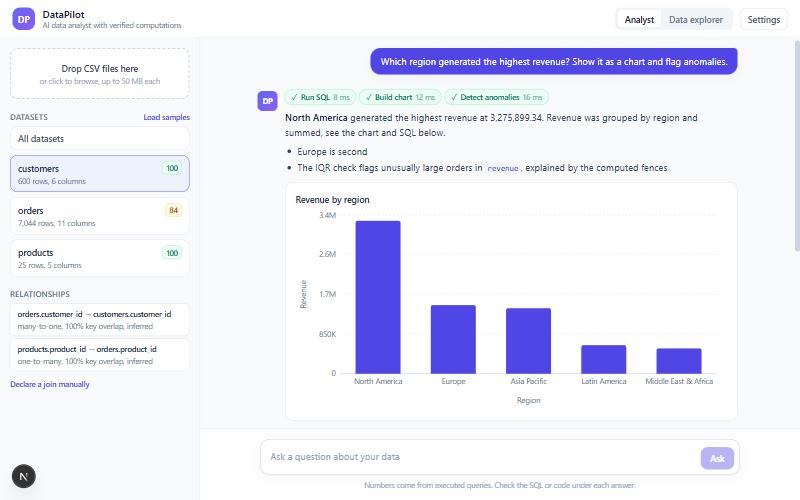
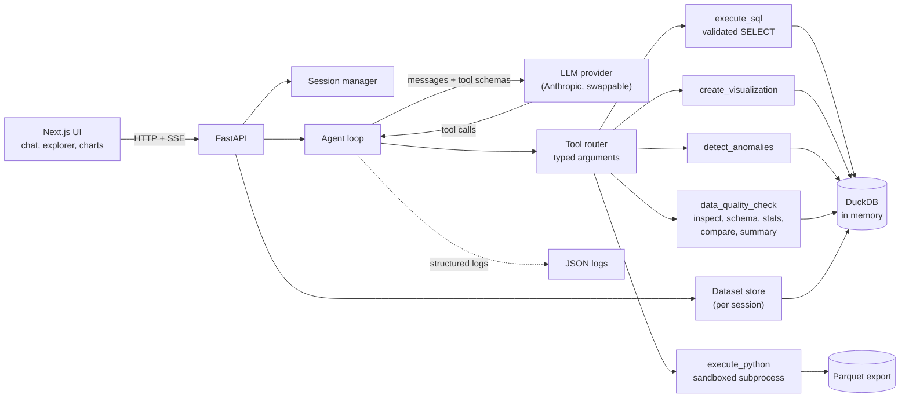
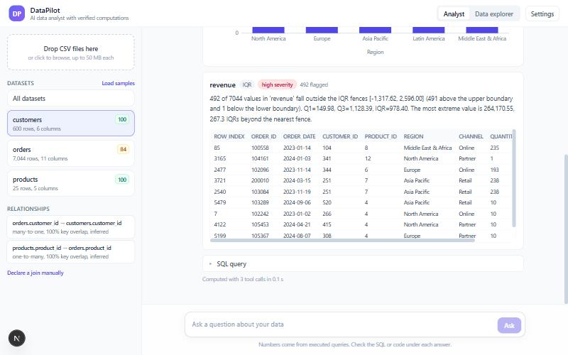
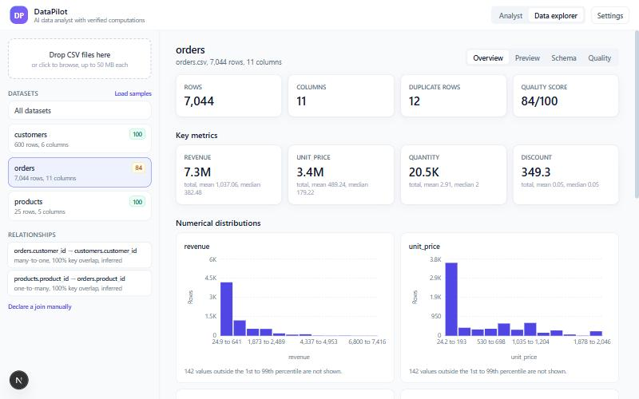
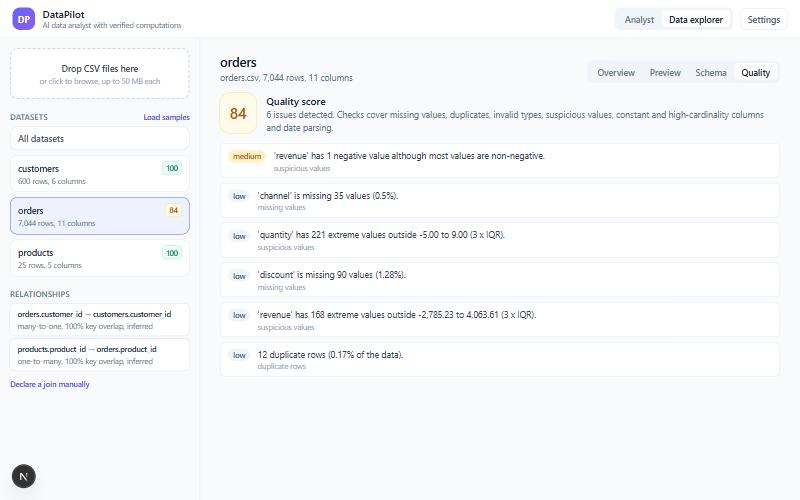

# DataPilot

An AI data analyst for CSV files. Upload one or more datasets, ask questions in plain English, and get answers, charts, SQL, anomaly explanations and data quality reports.

The LLM never does the maths. It plans, picks tools and writes queries. Deterministic tools (DuckDB, pandas, statistics code) execute everything against the real data, and every figure in an answer can be traced back to a tool result.



## Features

- **CSV upload**: drag and drop several files at once. Validation covers extension, size, binary content, empty files, encoding (UTF-8 and Latin-1) and delimiter detection. Malformed rows are skipped and reported instead of failing the file.
- **Dataset profiling**: columns, types, kinds (numeric, categorical, date, text, boolean), missing values, duplicates, cardinality, ranges, top values, preview and a schema viewer.
- **Data quality**: missing values, duplicate rows, numbers stored as text, unparseable dates, inconsistent categories (case and whitespace), constant columns, high-cardinality columns, negative or extreme values. A 0 to 100 score per dataset.
- **Dataset overview**: key metrics, clipped histograms, categorical breakdowns, missing data summary and suggested questions generated from the schema.
- **Natural language analysis**: rankings, trends, comparisons, averages, joins, correlations and SQL generation, all executed on the data.
- **Charts**: bar, line (with series), pie, scatter and histogram. Chart values come from a SQL query the tool executes, never from the model.
- **Anomaly detection**: IQR, z-score and a time aware rolling median method. Each result carries the affected rows, the bounds, a severity and a reason computed from the statistics.
- **Multi-file analysis**: join keys are inferred from names and value overlap (with cardinality), can be declared manually, and are given to the model with advice to avoid fan-out double counting.
- **Conversation memory**: previous questions, tool results and a "focus" (for example `region = North America`) are kept so follow-ups like "show me its monthly trend" resolve correctly.
- **Streaming**: server-sent events stream text, tool calls and tool results as they happen.
- **Grounding check**: after each answer, numbers that do not appear in any tool result are flagged to the user.
- **Observability**: structured JSON logs with request and session IDs, tool timings, query timings and LLM latency and token counts.

## Architecture



One turn of the agent loop:

```
user question
  -> system prompt (schema, relationships, conversation state, rules) + history
  -> LLM streams text and/or structured tool calls
  -> tool router validates arguments with Pydantic and runs the deterministic tool
  -> tool result goes back to the LLM (rows trimmed, never the full dataset)
  -> repeat up to MAX_AGENT_STEPS
  -> final answer, grounding check, history and analysis record saved
```

The model only ever sees the schema, statistics, a few sample values and the (trimmed) result of each tool call. Full datasets stay inside DuckDB.

### Repository layout

```
backend/app/
  main.py            FastAPI app, middleware, error handlers
  config.py          environment based settings
  models.py          typed models shared by tools and API
  session.py         in-memory sessions with expiry
  api/               routes and request/response schemas
  agent/
    agent.py         the tool calling loop, streaming events, grounding check
    tools.py         tool definitions, argument models, router
    prompts.py       system prompt and conversation state
    llm.py           provider abstraction and the Anthropic implementation
  data/
    loader.py        upload validation and CSV loading
    datasets.py      per-session DuckDB store
    profiler.py      schema inference and column statistics
    quality.py       data quality checks
    anomalies.py     IQR, z-score, rolling median
    charts.py        chart data from query results
    relations.py     join key inference
    engine.py        SQL validation and execution
    sandbox.py       Python sandbox (parent side)
    sandbox_runner.py  Python sandbox (child process)
    overview.py      dashboard summary and suggested questions
frontend/src/        Next.js app, components, API client, SSE parser
data/                sample CSVs and the script that generated them
tests/               pytest suite (no LLM or network needed)
evaluation/          ground truth evaluation cases and runner
docs/                reviewer checklist and screenshots
```

## Tech stack

| Layer | Choice |
| --- | --- |
| Frontend | Next.js 15, TypeScript, Tailwind CSS, Recharts |
| Backend | Python 3.11+, FastAPI, Pydantic |
| Data | DuckDB (SQL), pandas and numpy (statistics, sandbox), PyArrow (Parquet hand-off) |
| LLM | Anthropic Messages API with tool use, behind a small `LLMProvider` class |
| Tests | pytest, Vitest |
| Packaging | Docker and docker-compose |

## Setup

Requirements: Python 3.11+, Node 20+, an Anthropic API key for live questions.

```bash
cp .env.example .env
```

Edit `.env` and set `ANTHROPIC_API_KEY`. Everything except asking questions (upload, preview, quality, overview, tests) works without a key.

### Environment variables

| Variable | Default | Purpose |
| --- | --- | --- |
| `ANTHROPIC_API_KEY` | empty | LLM access. Never sent to the browser. |
| `LLM_MODEL` | `claude-sonnet-5-5` | Model used by the agent |
| `LLM_MAX_TOKENS` | `2048` | Max output tokens per LLM call |
| `MAX_UPLOAD_MB` | `50` | Per file upload limit |
| `MAX_FILES_PER_SESSION` | `10` | Datasets per session |
| `SESSION_TTL_MINUTES` | `120` | Idle session expiry |
| `MAX_RESULT_ROWS` | `200` | Rows returned per query |
| `SQL_TIMEOUT_SECONDS` | `15` | Query cancellation |
| `PYTHON_TIMEOUT_SECONDS` | `10` | Sandbox wall clock limit |
| `PYTHON_MEMORY_MB` | `2048` | Sandbox memory limit (Linux) |
| `MAX_AGENT_STEPS` | `8` | Tool loop bound per question |
| `CORS_ORIGINS` | `http://localhost:3000` | Allowed browser origins |
| `SAMPLE_DATA_DIR` | `./data` | Folder offered by "Load sample data" |
| `NEXT_PUBLIC_API_URL` | `http://localhost:8000` | Frontend to backend URL (frontend `.env`) |

## Running locally

Backend:

```bash
cd backend
pip install -r requirements.txt
uvicorn app.main:app --reload --port 8000
```

Frontend:

```bash
cd frontend
npm install
npm run dev
```

Open http://localhost:3000, click **Load sample data** and start asking questions.

### Tests

```bash
pip install -r backend/requirements-dev.txt
pytest
cd frontend && npm test && npm run typecheck
```

## Running with Docker

```bash
cp .env.example .env
docker compose up --build
```

The UI is on http://localhost:3000 and the API on http://localhost:8000. The backend container runs as a non-root user with a read-only root filesystem, dropped capabilities and a tmpfs for uploads. The sample data is mounted read-only from `./data`.

## Example questions

With the sample data (`orders.csv`, `customers.csv`, `products.csv`):

- Which region generated the highest revenue?
- Show monthly sales trends
- Which products are underperforming?
- What are the top five customers by revenue?
- What is the average order value?
- Compare revenue between regions
- Which month had the highest sales?
- Detect anomalies in revenue and explain them
- Were there unusual spikes in order volume over time?
- Compare revenue across customer segments (uses a join)
- How correlated are quantity and revenue? (uses Python)
- Generate SQL for revenue by region
- Which region has the highest revenue? followed by Show me its monthly trend

The sample data (`data/generate_sample_data.py`, seeded) contains seasonality, growth, one dominant region, deliberately weak products and planted problems: a handful of huge orders, a negative revenue row, an order spike on 2024-03-15, a sales dip in mid August 2023, missing values and duplicate rows.

## Agent and tool architecture

All tools take Pydantic argument models and return a typed `ToolResult` (data, error, SQL, code, table, chart, anomalies). Invalid arguments, unknown tools and tool failures come back to the model as readable errors so it can correct itself.

| Tool | What it does |
| --- | --- |
| `inspect_dataset` | Row count, columns, types, ranges, sample rows |
| `get_schema` | All datasets, columns and relationships |
| `get_column_statistics` | Exact statistics for one column |
| `execute_sql` | Validated read-only DuckDB SELECT |
| `execute_python` | Sandboxed pandas and numpy for what SQL cannot express |
| `create_visualization` | Runs the supplied SQL and builds a chart (bar, line, pie, scatter, histogram) |
| `detect_anomalies` | IQR, z-score or time series detection, one column or a scan |
| `data_quality_check` | The quality report for a dataset |
| `compare_datasets` | Shared columns, join candidates with overlap and cardinality, join SQL |
| `generate_summary` | Dashboard style overview with suggested questions |
| `set_context_filters` | Remembers entities in focus for follow-up questions |

The user facing explanation is analytical provenance, not hidden reasoning: the executed SQL or code, the tool timeline and the computed anomaly reason.

The LLM sits behind `LLMProvider.stream(system, messages, tools)` in `agent/llm.py`. To use another provider, implement that one method and return it from `create_provider`.

## Security considerations

- **Uploads**: extension allow list, size limit enforced while reading, NUL byte (binary) check, empty file check, re-encoding to UTF-8, random file names in a per-session temp directory removed when the session ends.
- **SQL**: every query is parsed by DuckDB. Exactly one statement, SELECT only, table function calls restricted (no `read_csv`, `glob` and similar), only the session's own tables allowed, execution timeout and row cap. Mutations, `ATTACH`, `COPY`, `PRAGMA` and multi statement input are rejected before execution.
- **Python**: the code is checked with an AST allow policy (no imports, no dunder access, no `open`, `eval`, `getattr`, file or network pandas and numpy functions) and then runs in a separate interpreter with an empty environment, an empty working directory, a restricted builtins table, a wall clock timeout and (on Linux) CPU, memory and file size limits. The model can never run shell commands. See the limitations for what this does and does not guarantee.
- **Prompt injection**: dataset values are truncated in the prompt and the system prompt marks them as untrusted data.
- **API hygiene**: typed request validation, sanitised error messages (no stack traces, technical detail goes to the server log), request IDs, CORS allow list, no secrets in responses or logs.
- **Privacy**: logs contain timings, tool names, truncated SQL text and sizes, never result rows.

## Evaluation methodology

`evaluation/cases.py` defines representative questions. Ground truth is computed independently with pandas straight from the CSV files, so there are no hard-coded expected numbers.

```bash
python evaluation/run_eval.py --mode tools
python evaluation/run_eval.py --mode live
```

- **tools mode** (no LLM, runs in CI as `tests/test_evaluation.py`): executes a reference tool plan for each case on the real tools and checks numeric correctness against pandas, SQL validity, chart generation, anomaly detection, rejection of destructive SQL, missing column handling, empty results (no fabrication) and the grounding detector.
- **live mode** (needs `ANTHROPIC_API_KEY`): lets the model plan. It additionally checks tool selection, that the expected facts appear in the answer, that no ungrounded numbers were produced, and that ambiguous or unanswerable questions are handled with an assumption or an honest "no data" answer.

Categories: numeric, multi_file, python, chart, anomaly, sql, quality, hallucination, safety, ambiguity, context. Results are written to `evaluation/results/`; the committed `tools_mode.json` is the latest tools mode run (21 of 21 passing).

## Screenshots

| | |
| --- | --- |
|  |  |
| Answer with tool timeline and a chart | Anomaly card with a computed explanation and affected rows |
|  |  |
| Dataset overview with clipped distributions | Data quality report |

The screenshots were captured without an API key, using the scripted stand-in LLM from the test suite. The tool calls, SQL, chart data, anomaly statistics and quality results in them are real and computed on the sample data; only the model's wording was scripted.

## Demo video

No video is bundled. A good two minute walkthrough: load sample data, open Data explorer (overview and quality), ask "Which region generated the highest revenue?", then "Show me its monthly trend" (context), "Detect anomalies in revenue and explain them", "Generate SQL for revenue by region" (expand the SQL block), then upload an invalid file to show error handling.

## Design decisions

- **DuckDB as the single analytical engine.** CSVs become in-memory tables, so SQL, profiling, anomaly input and chart data all use one fast engine with no server.
- **Tools own the numbers.** Aggregations, statistics, anomaly bounds and chart points are computed in code. The model synthesises and explains. A grounding check catches numbers that slip through.
- **Pydantic at every boundary.** Tool arguments, tool results and API payloads are typed, and the JSON schemas sent to the model are generated from the same classes.
- **Parser based SQL guard.** Validation walks DuckDB's own parse tree rather than matching strings, so comments, casing and nesting cannot hide a forbidden call.
- **Subprocess sandbox for pandas.** Simple, portable and enough for an assignment, with clear honesty about its limits.
- **Server side sessions in memory.** No database to run. Sessions expire and clean up their temp files.
- **Plain SSE over fetch.** One POST that streams typed events. No WebSocket or extra client library.
- **Small module count.** Modules follow responsibilities (loader, profiler, quality, anomalies, charts) rather than one file per function.

## Known limitations

- **Sandbox strength.** The Python sandbox is defence in depth (AST policy, separate process, empty environment, limits), not a hardened jail. Memory, CPU and file size limits only apply on Linux. Run the backend in a container with no extra privileges (the compose file does) and treat `execute_python` as the riskiest tool. Network blocking relies on the AST policy plus the absence of imports, not on a network namespace.
- **Not verified here.** The environment used to build this had no Anthropic API key and no running Docker daemon. The live LLM path is covered with a faked client in the tests, but live evaluation (`--mode live`) and `docker compose up` were not run end to end. The sandbox resource limits were not exercised on Linux.
- **In-memory sessions.** A server restart drops sessions and uploaded data. Run a single backend worker.
- **One DuckDB per session** with a 1 GB memory limit by default. Very large files should be sampled or pre-aggregated.
- **Anomaly defaults.** IQR on heavily skewed columns such as revenue flags many legitimate large orders; z-score or the time series method may suit better, and the model can choose.
- **Join inference is name based.** Keys whose names do not match (`cust` vs `customer_id`) need a manual relationship from the sidebar.
- **Grounding check is heuristic.** It compares numbers in the text with tool output within display rounding, so percentages the model computes itself are flagged even when correct, which is intended.
- **No authentication.** Sessions are identified by an unguessable ID only.
- **Desktop oriented UI.** The layout targets laptop and desktop widths.
